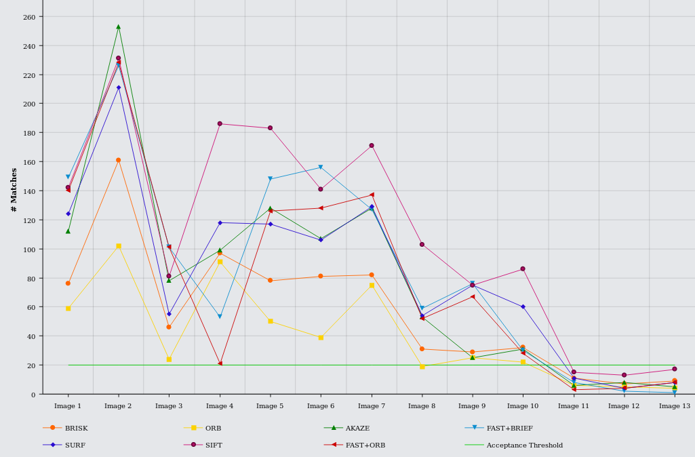
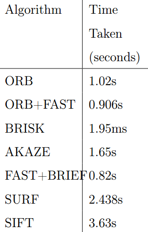
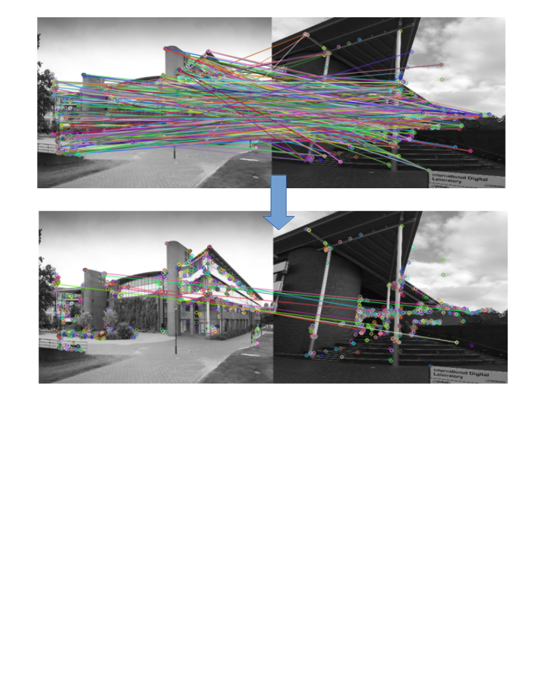
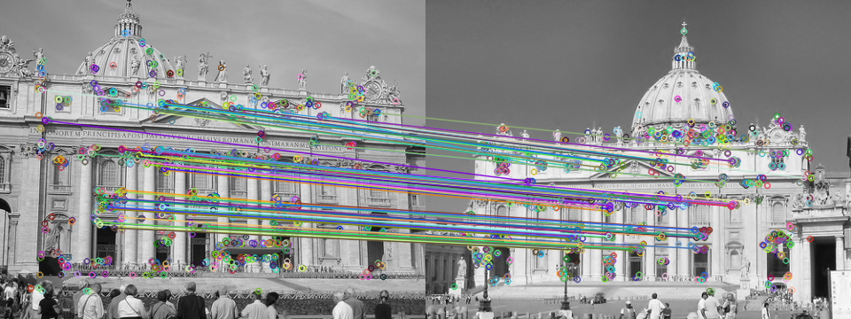

# Android Application for Real Time Image Matching in Smartphones.
Several description algorithms were evaluated for real time performance and matches corrected for accuracy by adding tests for the matches identified by patch descriptors. 
Image matching algorithm was run as native code with Android NDK and multi-threading. 

### Prerequisites
- OpenCV 3.2
- Android SDK 23.0 - 25.0
- Android NDK 

### Results
Several tests were applied to fix the numerous greedy matches that occur in vanilla patch description algorithms. 
- RANSAC
- Ratio check
- Symmetry check
- Angle consistency  

The system is also reaonably invariant to viewpoint change.  

<figure>
  
  <figcaption>Accuracy of several patch description algorithms on images of increasing variations. 20 point matches is considered the threshold to be labelled as matched.
</figcaption>
</figure>  
<figure>
  
  <figcaption>Time taken for matching 16 pairs.</figcaption>
</figure> 
<figure>
  
  <figcaption>Before and after tests with a false pair.</figcaption>
</figure> 
<figure>
  
  <figcaption>A true positive pair with scale and viewpoint changes after tests.</figcaption>
</figure> 

